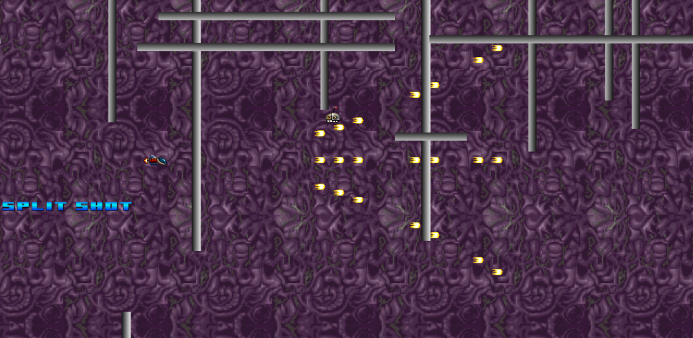

# Shooter
This is the start of a classic R-Type shooter game.  Most of the code and assets are from the [Phaser Shoot'em Up in Tutorial](https://phaser.io/tutorials/coding-tips-007) converted into TypeScipt.


## Getting Started
Yeah, the boring command line stuff.  

To get started you'll first want to bring in Phaser, and the rest of the JavaScript dependant files for your project. This can be easily done from the command line using [NodeJS](https://nodejs.org/en/):
```
npm install
```

The next thing we want to do is to compile the source code.  There are several ways to do this.  
Most editors (Atom, Sublime, or VisualStudio Code) will compile on save.  
Another alternative is to run the command line compile:
```
npm run tsc
```

Once the source is compiled, start the webserver.
```
npm start
```

## End Result

You should end up with a sample app like this:



